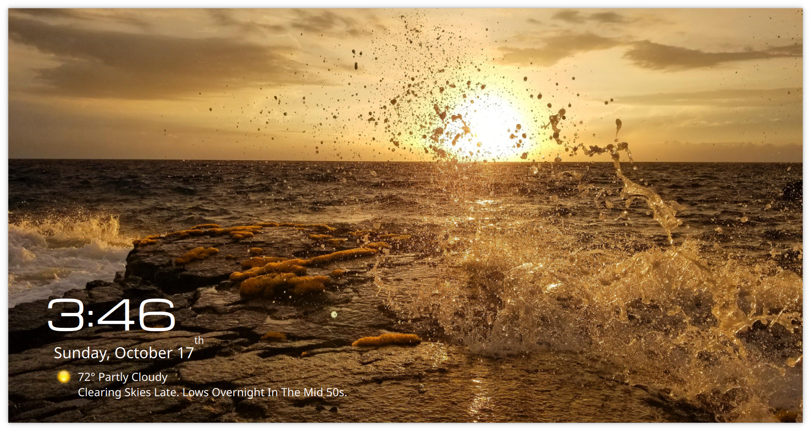
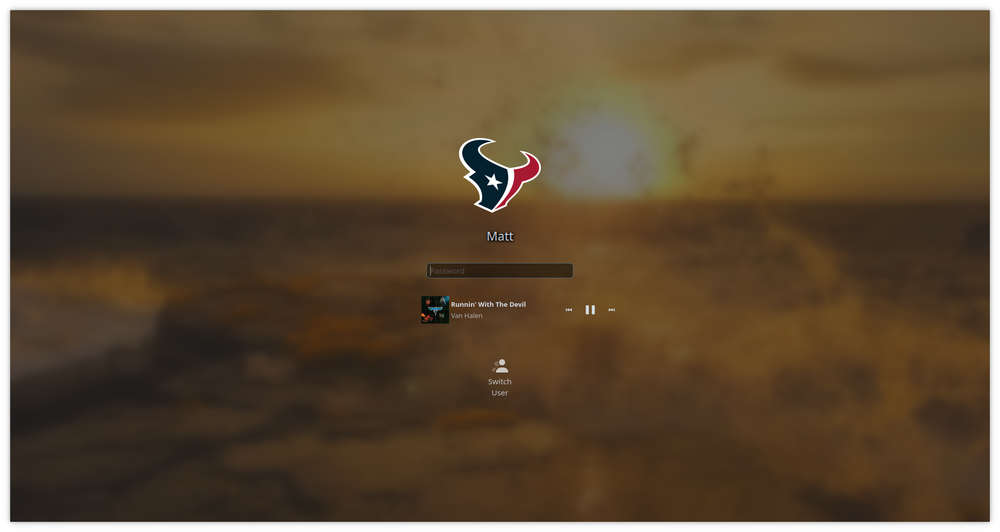

# Custom Plasma Lockscreen Win 10 style

## Modifications
* Display unread gmail messages count, current weather temp and conditions
* kb/mouse movement, hide clock and status info, show login/password Ui

[
[

### How it works:
For security reasons, kscreenlocker does not allow internet acesss, 
this is a hack using local files as JS variables  
Modified Breeze plasma qml files to get the desired effects. Designed for 1920x1080 screens.  
Using javacript node and python to create JS variables written to file system  
The JS variables are used within qml losckreen files and systemd scripts to update them.  

See this for more info https://github.com/txhammer68/plasma-Lockscreen-nest-hub/blob/master/readme.md#custom-plasma-lockscreen
